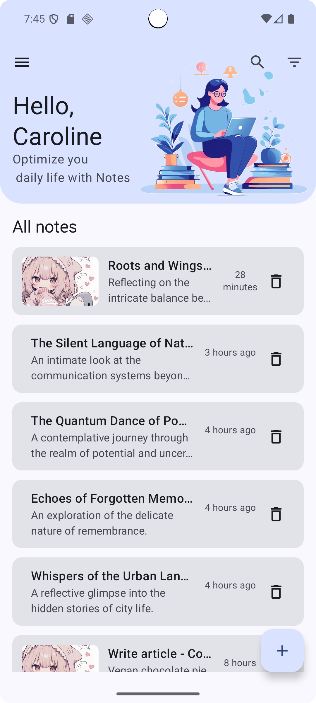

# **📝 Compose Notes**

Welcome to Compose Notes, a modern and intuitive note-taking application built entirely with **Jetpack Compose**, Android's contemporary UI toolkit. This project serves as a practical example of modern Android development, showcasing a fully reactive UI, robust local database storage with image support, and a polished, user-centric design. The app is designed to be simple enough for daily use yet comprehensive enough to demonstrate powerful architectural patterns and libraries.

It's a perfect starting point for developers looking to dive into Compose or see how various Jetpack libraries work together seamlessly to create a fluid and responsive user experience.

## **✨ Features**

This application is packed with features designed for a seamless and efficient note-taking experience.

* **Full CRUD Operations:** The core of any notes app. You can effortlessly **C**reate new notes on the fly, **R**ead them in a clean, distraction-free view, **U**pdate them with new thoughts or edits, and **D**elete them once they're no longer needed. The entire workflow is designed to be intuitive and fast.
* **Rich Image Support:** Why just write when you can show? Enhance your notes by adding images directly from your device's gallery. This feature is perfect for visual thinkers, students capturing whiteboard notes, or anyone who wants to add a visual dimension to their ideas. Images are stored efficiently and displayed beautifully alongside your text.
* **Clean, Modern UI:** The user interface is crafted with a minimalist philosophy using **Material 3** components. This ensures a consistent, visually appealing, and easy-to-navigate experience that adheres to the latest Android design standards. Every animation, button, and layout is designed to be both beautiful and functional.
* **Dual-Theme Support:** Whether you're a fan of bright, clean interfaces or prefer a darker look that's easier on the eyes at night, we've got you covered. The app seamlessly switches between a **light and a dark theme** based on your system settings, ensuring optimal readability and comfort in any lighting condition. 🌗
* **Efficient & Scalable Data Handling:** The app is built to handle your data gracefully, whether you have ten notes or ten thousand. We use the **Room DB** persistence library for reliable and fast local storage. For displaying long lists of notes, **Paging 3** is implemented to load data in small chunks, ensuring the UI remains smooth and responsive without consuming excessive memory.

## **🛠️ Tech Stack & Libraries**

This project leverages a cutting-edge, all-Kotlin tech stack to deliver a robust, maintainable, and high-performance application.

* **UI:** [Jetpack Compose](https://developer.android.com/jetpack/compose) \- The entire user interface is built with Android's modern, declarative UI toolkit. This allows for more concise, maintainable, and faster UI development compared to traditional XML layouts.
* **Design System:** [Material 3](https://m3.material.io/) \- We use the latest version of Google's open-source design system, which provides a rich set of beautiful, dynamic, and customizable UI components, including support for dynamic color.
* **Architecture:** **MVVM (Model-View-ViewModel)** \- The app follows the official recommended architecture pattern, promoting a separation of concerns that makes the codebase clean, scalable, and easy to test.
* **Database:** [Room DB](https://developer.android.com/training/data-storage/room) \- As an abstraction layer over SQLite, Room provides compile-time query verification and boilerplate reduction, making database interactions safer and simpler.
* **Navigation:** [Navigation Compose](https://developer.android.com/jetpack/compose/navigation) \- Manages all in-app navigation. It provides a type-safe and lifecycle-aware API for moving between different composable screens, making complex navigation flows straightforward to implement.
* **Image Loading:** [Coil3](https://coil-kt.github.io/coil/) \- A fast, lightweight, and modern image loading library for Android written in Kotlin. It's highly optimized for performance and handles everything from fetching and decoding to caching and displaying images with minimal setup.
* **Paging:** [Paging 3](https://developer.android.com/topic/libraries/architecture/paging/v3-overview) \- This library is crucial for efficiently loading and displaying large lists of notes. It loads data from Room DB on demand, reducing network usage and system resources, resulting in a faster, smoother scrolling experience.
* **Asynchronous Programming:** **Kotlin Coroutines & Flow** \- Used throughout the application to manage background threads and handle asynchronous data streams from the database. This ensures the main thread is never blocked, resulting in a consistently responsive UI.

## **📸 Screenshots**

|                         Light Theme                         |                           Dark Theme                           |
|:-----------------------------------------------------------:|:--------------------------------------------------------------:|
|          |         |
|   |  |

## **🚀 Setup and Installation**

To get this project up and running on your local machine for development and testing, please follow these simple steps.

1. Clone the repository:  
   Open your terminal or Git client and clone this repository to your desired directory.  
   git clone https://github.com/dontknow492/Notes.git

2. Open in Android Studio:  
   Launch Android Studio (preferably the latest stable version, like Hedgehog or newer) and select "Open" to navigate to the cloned project directory.
3. Sync Gradle:  
   Android Studio will automatically detect the Gradle files. Allow it a few moments to download all the required dependencies and sync the project.
4. Run the app:  
   Once the Gradle sync is complete, you can build and run the application. Choose an available emulator or connect a physical Android device, then click the 'Run' button.
